<div align="center">


# DeskFence

**把 Windows 桌面还给你 —— 自动分类、原生观感、零感知的桌面图标栅栏**

[](https://github.com/zghehehe/DeskFence/releases/latest)
[](LICENSE)


[**⬇ 下载最新版**](https://github.com/zghehehe/DeskFence/releases/latest/download/deskfence.exe) · [全部版本](https://github.com/zghehehe/DeskFence/releases) · [问题反馈](https://github.com/zghehehe/DeskFence/issues)



*单文件 · 免安装 · 静态链接,无需任何运行库*

</div>

---

轻量级 Windows 桌面图标栅栏整理工具。把桌面图标按类别收进"栅栏"，图标、
图标名、右键菜单全部取自 Windows Shell 原生资源，观感与原生桌面一致。
Rust + Win32 + Direct2D 实现。

## 特性

- **自动分类**：软件 / 文件夹 / 文档 / 图片 / 媒体 / 代码 / 压缩包自动分栏，
  支持手动钉选、拖入拖出、使用频率排序
- **原生观感**：图标取自系统图像列表（含 .lnk 箭头），图标名用 Explorer
  同源字体 + ClearType 渲染；精确模式下与原生桌面逐像素一致
- **插入式拖拽**：栅栏与图标拖动时实时提示插入位置，其余内容不动，
  松手才拼接落位，Esc 取消
- **三态桌面**（托盘菜单切换，重启保持）：
  - 正常：栅栏接管桌面
  - 纯净：栅栏与图标都隐藏，只剩壁纸
  - 原生：恢复 Explorer 原生图标
- **无边框常显**：平时完全干净，悬停才浮现边框/标题/手柄
- **多显示器 + 高 DPI**；开机自启动（托盘开关），进程拉起后约 0.3 秒全量呈现
- 撤销、单实例、Explorer 重启自愈

## 安装

### 方式一：直接下载（推荐）

1. 到 [Releases](https://github.com/zghehehe/DeskFence/releases/latest) 下载 `deskfence.exe`
2. 双击运行即可。首次运行如遇 SmartScreen 提示：点"更多信息 → 仍要运行"
3. 程序常驻托盘（右下角图标），右键托盘图标进行管理

卸载 = 托盘退出后删除 exe 与 `%APPDATA%\DeskFence` 目录。

### 方式二：源码构建

前置：[Rust](https://rustup.rs) stable（MSVC 工具链，需安装
[Visual Studio 生成工具](https://visualstudio.microsoft.com/zh-hans/downloads/)）。

```bash
git clone https://github.com/zghehehe/DeskFence.git
cd DeskFence
cargo build --release
# 产物：target/release/deskfence.exe
```

应用图标与清单资源已预编译内置（`resources/deskfence.res`），构建不需要
windres 等额外工具。

## 使用速览

| 操作 | 方式 |
|---|---|
| 新建/重排/渲染模式 | 桌面空白右键 → DeskFence 子菜单 |
| 隐藏全部栅栏（纯净桌面）/ 恢复原生桌面 / 开机自启 | 右键托盘图标 |
| 移动/缩放/折叠/锁定栅栏 | 拖标题栏、拖角手柄、栅栏右键菜单 |
| 拖拽取消 | 按住时按 Esc |
| **自救**：恢复系统桌面图标并退出 | `deskfence.exe --restore-desktop` |

数据位置：`%APPDATA%\DeskFence`（配置、壁纸与图标缓存），删除即重置。
程序不联网、不收集任何数据——完全开源，可自行审计。

## 常见问题

- **SmartScreen / 杀软提示？** 程序未做付费代码签名。完全开源可自行审阅
  与源码构建；杀软偶发静态链接误报，加白名单即可。
- **出问题桌面失控？** 运行 `deskfence.exe --restore-desktop` 恢复原生
  桌面图标（无 UI 自救模式）。

## License

[MIT](LICENSE)
